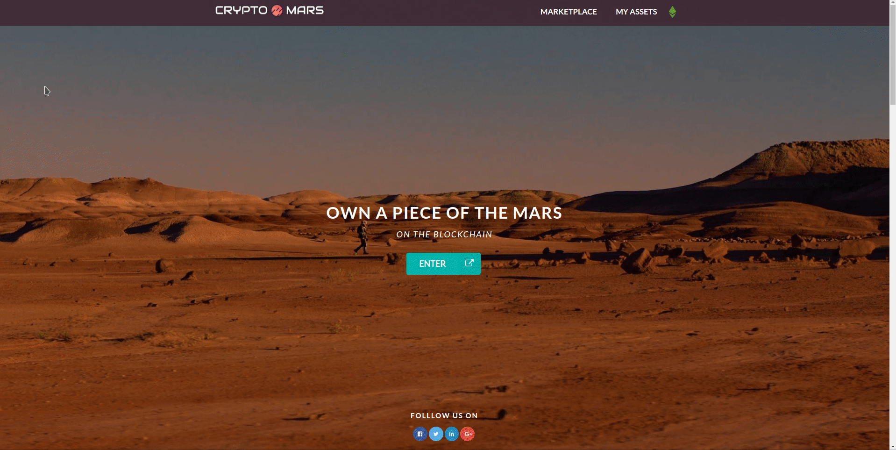

# Blockchain Crypto Mars

Frontend project part created for a USA client's Etherium Blockchain backend project. (This repo only contain, Simple & Stripped Down Version of it) It's a custom created, interactive SVG-Map related product and contains a landing page and dashboard. On the dashboard, users can view each map part's details, buy sections, etc... when connected to the backend.

Live Link - <a href='https://cryptomars.surge.sh/' target='_blank'>https://cryptomars.surge.sh/</a>
